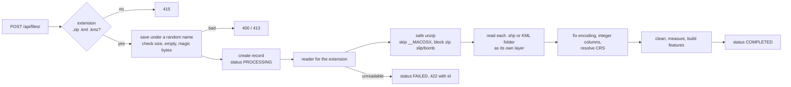

# Geospatial File Measurement API

Upload a zipped Shapefile, a KML or a KMZ and get the area of every polygon and the length of every line, in metres. The numbers are true ground values: a 1 km square near Bengaluru comes back as 1,000,000.00 m², where plain UTM says 1,001,154 m².

Built with FastAPI, GeoPandas (pyogrio/GDAL), Shapely 2 and pyproj, for the Aereo SDE intern assignment.

**Contents:** [Setup](#setup) · [API](#api) · [Architecture](#architecture) · [Accuracy](#accuracy) · [Real-world files](#real-world-files) · [Design decisions](#design-decisions) · [Requirements checklist](#requirements-checklist) · [Testing](#testing) · [Performance](#performance) · [Learnings](#learnings) · [Future scope](#future-scope)

## What's different here

- **Area on the ground, not on the map.** UTM stretches the map by a scale factor that changes with position. Around Bengaluru it makes every area 0.115% too big (about 50 sq ft on a one-acre plot). I project to UTM as the assignment asks, then divide that stretch out, and check every feature against an ellipsoid calculation (GeographicLib, the library QGIS uses for its ellipsoidal measurements).
- **Files as people actually send them.** Zips made on a Mac, Shapefiles missing their `.prj` or `.cpg`, Kannada and Hindi attribute text, Google Earth folders, ArcGIS KML exports with attributes hidden in HTML, self-intersecting polygons. Each case has a sample file and a test.
- **Mining-aware lines.** KML lines with real heights (haul roads, drone flight tracks) also get slope length and steepest grade, flagged against the DGMS limit of 1 in 16 for haul roads.

## Setup

**With Docker** (one command):

```bash
docker compose up --build
```

Open http://localhost:8000/docs for interactive API docs. The SQLite database lives on a Docker volume, so results survive restarts.

**Without Docker** (Python 3.12):

```bash
python -m venv .venv
source .venv/bin/activate        # Windows: .venv\Scripts\activate
pip install -r requirements-dev.txt
uvicorn app.main:app --reload
```

No GDAL install is needed: the pyogrio and pyproj wheels bundle GDAL and PROJ.

**Tests, samples and the demo:**

```bash
pytest                              # 57 tests, about 10 s
python -m scripts.make_samples      # regenerates samples/
python -m scripts.demo              # calls every endpoint on a running server
python -m scripts.benchmark         # timings for 1k, 10k and 50k features
```

Settings (all optional, via environment variables): `DATA_DIR` (default `data`), `DATABASE_URL`, `MAX_UPLOAD_MB` (default 50).

## API

| Method | Path | What it does |
|---|---|---|
| `POST` | `/api/files/` | Upload a `.zip` (Shapefile), `.kml` or `.kmz`. Processes it and returns the file info. |
| `GET` | `/api/files/{id}/` | File info: name, feature count, CRS, status, layers, warnings |
| `GET` | `/api/files/{id}/measurements/` | Every feature with geometry, CRS, properties and measurements, plus totals |
| `GET` | `/viewer/{id}` | The results on a MapLibre map |
| `GET` | `/health` | Liveness check |

Every route also works without the trailing slash.

### `POST /api/files/`

```bash
curl -F "file=@samples/bellary_mine_survey.kml" http://localhost:8000/api/files/
```

```json
{
  "id": "9ab44ec7360c40969f8d7ef7e32f2fe4",
  "filename": "bellary_mine_survey.kml",
  "feature_count": 7,
  "crs": "EPSG:4326",
  "status": "COMPLETED",
  "file_format": "kml",
  "layers": ["Mining lease", "Pits", "Haul roads", "Survey flights"],
  "warnings": [],
  "error": null,
  "created_at": "2026-10-06T20:46:48.482439Z",
  "processed_at": "2026-10-06T20:46:48.659435Z"
}
```

Optional query parameter `source_crs`: the CRS to use for a Shapefile that has no `.prj`, for example `?source_crs=EPSG:32643`.

The file is processed inside the request, so the response already says `COMPLETED` or the request fails with a 4xx. A file that was stored but could not be read is kept with `status: FAILED`, and its id is returned with the error:

```json
{
  "detail": "site_plan: there is no .prj file and the coordinates (x=774000, y=1434000) are not longitude/latitude, so the CRS cannot be guessed. Upload again with ?source_crs=<code>, for example ?source_crs=EPSG:32643 for UTM zone 43N.",
  "id": "9a01c6bf7a0c40eabffa31f028494841",
  "status": "FAILED"
}
```

| Status | When |
|---|---|
| `201` | Processed. `status` is `COMPLETED`. |
| `400` | Empty file, content that doesn't match the extension, corrupt zip, a zip without a `.shp`, unsafe paths in a zip, an invalid `source_crs` |
| `413` | Upload over `MAX_UPLOAD_MB`, or a zip that expands more than 10x that (zip bomb) |
| `415` | Not a `.zip`, `.kml` or `.kmz` |
| `422` | GDAL can't read it, it has no features, or it's projected data with no `.prj`. The record is kept as `FAILED`. |

### `GET /api/files/{id}/`

Returns the same shape as the upload response. `404` if the id doesn't exist.

### `GET /api/files/{id}/measurements/`

Query parameters: `limit` and `offset` for paging, and `format=geojson` for a GeoJSON FeatureCollection you can drop into QGIS or a web map. Returns `409` if the file is `FAILED`.

```json
{
  "file_id": "9ab44ec7360c40969f8d7ef7e32f2fe4",
  "filename": "bellary_mine_survey.kml",
  "status": "COMPLETED",
  "feature_count": 7,
  "geometry_crs": "EPSG:4326",
  "totals": { "area_sq_m": 1609999.84, "area_hectares": 161.0, "area_acres": 397.8396, "length_m": 2290.917, "length_km": 2.2909 },
  "features": [
    {
      "index": 0,
      "layer": "Mining lease",
      "geometry_type": "GeometryCollection",
      "geometry": { "type": "GeometryCollection", "geometries": [ { "type": "Point", "...": "..." }, { "type": "Polygon", "...": "..." } ] },
      "crs": "EPSG:4326",
      "properties": { "Name": "Lease ML-2231", "lease_id": "ML-2231", "mineral": "Iron ore" },
      "measurement": {
        "area_sq_m": 1440000.0, "area_hectares": 144.0, "area_acres": 355.8318,
        "length_m": null, "length_km": null, "length_3d_m": null, "max_grade_pct": null,
        "projected_crs": "EPSG:32643", "method": "utm_scale_corrected", "geodesic_diff_pct": 0.0
      },
      "notes": [],
      "error": null
    },
    {
      "index": 3,
      "layer": "Haul roads",
      "geometry_type": "LineString",
      "properties": { "Name": "Ramp R1", "ROAD_ID": "R1", "WIDTH_M": "18", "SURFACE": "Murrum" },
      "measurement": {
        "length_m": 593.861, "length_km": 0.5939, "length_3d_m": 595.611, "max_grade_pct": 10.75,
        "projected_crs": "EPSG:32643", "method": "utm_scale_corrected", "geodesic_diff_pct": 0.0
      },
      "notes": ["Steepest stretch is 10.8% (1 in 9), steeper than the 1 in 16 DGMS limit for mine haul roads."]
    },
    {
      "index": 4,
      "layer": "Haul roads",
      "geometry_type": "Point",
      "measurement": null,
      "notes": ["Points have no area or length."]
    }
  ]
}
```

(Shortened. The second and third features are trimmed to the interesting fields.)

What each feature field means:

| Field | Meaning |
|---|---|
| `index` | Position in the file, starting at 0, across all layers |
| `layer` | KML folder or Shapefile name |
| `geometry` | RFC 7946 GeoJSON: longitude/latitude (EPSG:4326), outer rings counter-clockwise, 7 decimals (about 1 cm) |
| `crs` | The CRS the file itself was in |
| `measurement.method` | `utm_scale_corrected` normally, `geodesic` when UTM wasn't good enough for that feature, `null` for points |
| `measurement.projected_crs` | The UTM zone used, for example `EPSG:32643` |
| `measurement.geodesic_diff_pct` | How far the UTM result was from the ellipsoid result |
| `notes` | Anything that was repaired, assumed or worth knowing |
| `error` | Set when this one feature couldn't be measured. The rest of the file is unaffected. |

## Architecture

```
app/
  main.py        HTTP layer: upload checks, routes, error responses, body size limit
  config.py      Limits and paths, each overridable by an environment variable
  db.py          SQLAlchemy models (files, features) and the startup clean-up
  readers.py     Upload checks, safe unzip, Shapefile/KML/KMZ readers and their quirks
  cleaning.py    Repairs geometry and records QC notes, splits polygons from lines
  measure.py     CRS choice, scale-factor correction, geodesic check, slope
  processor.py   The pipeline: read, clean, measure, store, set the status
  schemas.py     Response models and unit conversions
  static/viewer.html   MapLibre map of the results
tests/           factories.py builds every test file in code
scripts/         make_samples.py, demo.py, benchmark.py
samples/         Demo files, each with a real-world quirk
```

### File-processing flow



1. `main.py` rejects unsupported extensions (415). Starlette's `RequestBodyLimitMiddleware` rejects oversized bodies with 413 before the upload is written to disk.
2. The upload is saved under a random name in a temporary folder. The client's filename never becomes a path.
3. `readers.check_upload` rejects empty files and content that doesn't match the extension (a `.zip` must start with `PK`, a `.kml` must contain `<kml`).
4. A `files` row is created with status `PROCESSING`.
5. The reader for the extension runs:
   - **Zip:** safe extraction, then every `.shp` (in any folder) becomes a layer. Missing `.shx` is rebuilt, missing `.dbf` means no attributes, a missing `.cpg` triggers encoding detection. Integer columns that GDAL turned into floats are restored.
   - **KML:** every folder is read as a layer (GDAL's default reads only the first). Display-only columns are dropped, and ArcGIS HTML attribute tables are unpacked into properties.
   - **KMZ:** unzipped, then read as KML.
6. `processor.build_features` cleans, measures and stores each feature, and the status becomes `COMPLETED`.
7. Any reader error marks the record `FAILED`, stores the reason and returns a 4xx with the id. An unexpected exception is logged with a traceback and also reported as `FAILED` (422), so the client always gets an answer it can act on.
8. The temporary folder is deleted in every case. If the server stops mid-upload, the record is marked `FAILED` at the next startup instead of staying `PROCESSING` forever.

### Measurement flow

For each layer:

1. Reproject to EPSG:4326 (keeping Z values).
2. `cleaning.clean`: drop Z for the map measurement, repair invalid geometry with `make_valid` and note what changed.
3. `cleaning.split_parts`: separate polygons (area) from lines (length). Points give nothing. A GeometryCollection, like a KML polygon stored with its label point, keeps its area.
4. `measure.measure_all`:
   - Pick each feature's UTM zone from its centroid: `zone = floor((lon + 180) / 6) + 1`, EPSG `326xx` north or `327xx` south.
   - Group features by zone and reproject each group in one vectorised call.
   - Get the UTM point scale factor `k` at each centroid with `pyproj.Proj.get_factors`, then divide lengths by `k` and areas by `k²`.
   - Compute the same feature on the WGS84 ellipsoid with `pyproj.Geod` (rings oriented first). If the two differ by more than 0.01%, report the geodesic value and say why in `notes`.
5. For lines whose Z is a real height (Shapefile Z, or KML `altitudeMode` `absolute`): slope length and steepest grade, using geodesic horizontal distance between vertices.
6. Hectares, acres and kilometres are derived from the stored m² and m in `schemas.py`.

### CRS handling

| Situation | What happens |
|---|---|
| Shapefile with `.prj` | Its CRS is used. ESRI-style WKT is matched to an EPSG code where possible. |
| Shapefile without `.prj`, coordinates within ±180/±90 | EPSG:4326 assumed, with a warning |
| Shapefile without `.prj`, coordinates like `774000, 1434000` | Not guessed. 422 asking for `?source_crs=`. Assuming 4326 here would produce nonsense. |
| `?source_crs=` given | Overrides the file. Any conflict is reported as a warning. |
| KML / KMZ | Always EPSG:4326 (the KML spec). `source_crs` is ignored, with a warning. |
| Measuring | Never in degrees. UTM zone per feature plus scale-factor correction, geodesic as the check and fallback. |
| Output geometry | Always EPSG:4326 (RFC 7946). `crs` on each feature keeps the original CRS. |
| Projected input | The note gives the area in the file's own grid too, so a CAD user can see why it differs (a 100 × 80 m block drawn in UTM 43N is 8,000 m² on the grid and 7,991.54 m² on the ground). |

## Accuracy

Error against the WGS84 ellipsoid for a 1 km² square, from my experiments (the corrected column is what `tests/test_measure.py` checks):

| Location | Plain UTM | UTM + scale correction (this API) | Web Mercator (EPSG:3857) |
|---|---|---|---|
| Kutch (near the UTM 42N centre line) | −0.080% | 0.000000% | +19.1% |
| Bengaluru (2.6° from the UTM 43N centre line) | +0.115% | 0.000000% | +5.9% |
| Delhi | +0.035% | 0.000000% | +30.2% |
| Dhanbad coal belt | −0.072% | 0.000000% | +20.0% |

As features grow, the correction (taken at the centroid) stays close to the ellipsoid value (Bengaluru, squares with densified edges):

| Square side | 1 km | 10 km | 50 km | 100 km | 300 km |
|---|---|---|---|---|---|
| Error after correction | 0.00000% | 0.00002% | 0.0005% | 0.002% | 0.019% (falls back to geodesic) |

The geodesic check catches anything beyond 0.01%. For example, a densified line from Kutch to Kolkata crosses five UTM zones: UTM is 0.40% off there, so the API reports the geodesic length.

## Real-world files

| What arrives | What naive code does | What this API does | Test |
|---|---|---|---|
| Zip made on macOS (`__MACOSX/._parcels.shp`) | Picks the junk file as the Shapefile and fails | Skips it | `test_zip_from_a_mac_with_nested_folder` |
| Shapefile without `.cpg`, Kannada/Hindi names | `ರಾಮಪ್ಪ` becomes `ರಾಮ...` | Detects UTF-8, warns | `test_missing_cpg_keeps_kannada_and_hindi_names` |
| Blank cell in an integer column | Plot 101 becomes `101.0`, blanks become NaN and FastAPI returns 500 | Integers restored, blanks are `null` | `test_zipped_shapefile_with_blank_cells` |
| CAD export in UTM metres, no `.prj` | Treats 774000 as a longitude | 422 asking for `?source_crs` | `test_source_crs_for_shapefile_without_prj` |
| Missing `.shx` / `.dbf` | GDAL refuses / crash | Rebuilt / geometry only, with warnings | `test_missing_shx_is_rebuilt`, `test_missing_dbf_still_gives_geometry` |
| Google Earth KML with folders | Reads only the first folder | Every folder is a layer | `test_every_kml_folder_is_read` |
| Polygon stored with a label point (MultiGeometry) | GeometryCollection reported as unsupported | Polygon area measured | `test_label_point_does_not_hide_polygon_area` |
| ArcGIS "Layer To KML" export | Attributes stuck in one HTML blob | Unpacked into properties | `test_kml_attributes_from_extended_data_and_arcgis_html` |
| KML polygon with a hole, both rings counter-clockwise | Geodesic area adds the hole (+8.3% in my test) | Rings oriented first | `test_hole_is_subtracted_even_with_kml_ring_order` |
| Self-intersecting "bow-tie" polygon | Area 0, or half with `buffer(0)` | `make_valid`, full area, QC note | `test_bow_tie_keeps_both_halves` |
| GroundOverlay (image, no geometry) | Crash on `None` | Per-feature error, file still COMPLETED | `test_one_bad_feature_does_not_fail_the_file` |
| A `.txt` renamed to `.zip` | GDAL error, 500 | 400 "not a zip archive" | `test_bad_uploads_get_clear_4xx` |

## Design decisions

| Decision | Why | Alternatives I considered |
|---|---|---|
| **UTM per feature + scale-factor correction** | Satisfies "project before measuring" with an EPSG code every GIS user recognises, and gives true ground values. One extra pyproj call per zone. | Plain UTM (0.1% off in Bengaluru). Equal-area projection centred on each feature (exact for area, but a custom PROJ string nobody recognises, and lengths need a second projection). Geodesic only (exact, but skips the projection the assignment asks for). One national CRS (distorts at the edges of India). |
| **Geodesic check on every feature** | One rule replaces special cases for poles, the 180° meridian and huge features. It's also a built-in self-test. | Hard-coded rules for latitude and extent. Easy to get wrong and hard to test. |
| **Synchronous processing** | The spec says POST "uploads and processes". A client gets the final status in one call. The work is a few ms per feature. | Celery + Redis (more infrastructure, polling, harder to run locally). FastAPI `BackgroundTasks` (still needs polling, and work is lost on restart). The `status` field and the processor's boundary are where a queue would plug in. |
| **SQLite + SQLAlchemy** | Zero setup, one file, enough for this workload. The models don't depend on SQLite. | PostGIS: worth it for spatial queries and `ST_Area(geography)`, but the API only looks things up by id. |
| **GeoPandas with pyogrio (GDAL)** | One library reads Shapefile, KML (with LIBKML, so ExtendedData works) and KMZ. The wheels bundle GDAL. | Fiona (slower, being phased out). A hand-written KML parser (loses Shapefile support, easy to miss edge cases). |
| **Store m² and m only** | One source of truth. Hectares, acres and km are derived in the response, so adding a unit is a schema change only. | Storing every unit. Duplicated data that can disagree. |
| **GeoJSON output in EPSG:4326** | RFC 7946 requires it, and MapLibre and QGIS expect it. The original CRS is kept in `crs`. | Returning coordinates in the source CRS. Invalid GeoJSON for a UTM file. |
| **`make_valid` for broken polygons** | Keeps both halves of a bow-tie. | `buffer(0)` silently drops one half. Rejecting the feature loses data that's usually just a digitising slip. |
| **Errors per feature, not per file** | A GroundOverlay or a broken polygon shouldn't cost you the other 999 features. | Failing the whole file on the first bad feature. |
| **4xx for unreadable files** | It's the input that's wrong, and the client can fix it. The record is kept as `FAILED` so it can be looked up. | 500 for any GDAL error. Tells the client nothing useful. |
| **Size limit in middleware** | Starlette writes the whole upload to a temp file before the endpoint runs, so a check in the endpoint comes too late to protect the disk. | Checking `len(file)` in the handler. |

## Requirements checklist

| Requirement | Where | Tests |
|---|---|---|
| FastAPI backend | `app/main.py` | `tests/test_api.py` |
| `POST /api/files/` accepts `.zip` Shapefile and `.kml` | `main.upload_file`, `readers.READERS` | `test_upload_returns_completed_file_info`, `test_zipped_shapefile_with_blank_cells` |
| Extract features: id/index, geometry type, geometry, CRS, properties | `processor.build_features` | `test_measurements_endpoint` |
| Unsupported geometry handled gracefully | `processor.build_features`, `cleaning.split_parts` | `test_point_has_no_measurement`, `test_one_bad_feature_does_not_fail_the_file` |
| Polygon area, LineString length, Point none | `measure.measure_all` | `tests/test_measure.py` |
| No measuring in degrees; reproject first | `measure.measure_all` | `test_one_square_km_is_one_square_km`, `tests/test_properties.py` |
| `GET /api/files/{id}/` with id, filename, feature_count, crs, status | `main.get_file` | `test_file_info_endpoint` |
| `GET /api/files/{id}/measurements/` | `main.get_measurements` | `test_measurements_endpoint` |
| README: Setup, API, Architecture, Design Decisions, Learnings, Future Scope | this file | |

## Testing

57 tests in about 10 seconds. Every input file is generated in code by `tests/factories.py` (squares and lines of exact ground size, zipped Shapefiles with chosen sidecars left out, KML with folders, ExtendedData and ArcGIS-style HTML).

- `test_measure.py`: 1 km² squares at three Indian sites, a 10 km line, points, bow-ties, KML holes, label points, Z values, a line crossing five UTM zones, the 180° meridian, slope grade.
- `test_readers.py`: Mac zips, missing `.cpg`/`.prj`/`.shx`/`.dbf`, projected data without `.prj`, two Shapefiles in one zip, corrupt zips, zip slip, zip bombs, KML folders and attributes, altitude modes, KMZ.
- `test_api.py`: every endpoint and status code, GeoJSON export, paging, trailing slashes, `source_crs`, grid-vs-ground notes.
- `test_properties.py`: [Hypothesis](https://hypothesis.readthedocs.io/) generates hundreds of random squares and lines anywhere in India and checks rules that must always hold: a square of side s measures s², vertex order never changes area, and length is additive.

## Performance

`python -m scripts.benchmark` on a laptop, random parcels across two UTM zones, full pipeline (clean, measure, geodesic check, GeoJSON, JSON-safe properties):

| Features | Time | Per feature |
|---|---|---|
| 1,000 | 0.24 s | 238 µs |
| 10,000 | 2.9 s | 292 µs |
| 50,000 | 17 s | 340 µs |

Reprojecting features one at a time took 6.4 s for 10,000 features on its own. Grouping by UTM zone made reprojection a small part of the total. Profiling shows the rest: about 40% building GeoJSON and 25% in the geodesic check, both per-feature Python loops. Those are the next things to vectorise.

## Learnings

- **UTM isn't the true size.** I assumed "project to UTM" meant "correct in metres". It doesn't: the scale factor makes Bengaluru areas 0.115% too big, and a CAD drawing's 8,000 m² is 7,991.54 m² on the ground. Surveyors call this grid versus ground.
- **The common fixes are wrong in quiet ways.** `buffer(0)` halves a bow-tie. GDAL's default KML read drops every folder but the first. The ellipsoid area formula adds a KML hole instead of subtracting it if the ring direction is wrong.
- **Real files break code more than geometry does.** Mac zips, missing `.cpg` files and blank attribute cells caused more failures than any projection issue. One NaN in an attribute is enough to make FastAPI return a 500.
- **Property-based tests find what I didn't think to test.** Hypothesis found that two halves of a 36 km line add up to 3.6 cm less than the whole, because each half uses its own centroid's scale factor. That's 1 part per million, far inside tolerance, but I didn't know it until a test told me.
- **Pick test shapes carefully.** A square with only 4 corners hid UTM's distortion. Real boundaries have many vertices, and with those the error showed up.
- **Where limits are enforced matters.** A size check inside the endpoint runs after the whole upload is already on disk.

## Future scope

- **Background processing for large files:** return 202 with `PROCESSING` and process with a worker (Celery or arq). Read big layers in batches with pyogrio's Arrow streaming so memory stays flat.
- **PostGIS:** store geometry natively, cross-check with `ST_Area(geography)`, and allow spatial queries (all parcels inside a lease).
- **Vectorise the remaining per-feature loops** (GeoJSON building and the geodesic check).
- **Stockpile and pit volumes:** accept a DEM (GeoTIFF) and compute cut and fill inside each polygon against a base surface.
- **Overlap checks for parcels:** flag overlapping polygons, whose areas the totals currently count twice.
- **Accounts:** API keys, and only the owner can see a file.
- **Local units:** acre-gunta (Karnataka), cents (Kerala, Tamil Nadu), bigha (varies by state).
- **More formats:** GeoJSON, GeoPackage, DXF.
- **Per-segment scale factors** for very long lines, instead of one at the centroid.

## AI assistance

I built this with Claude Code as a pair programmer. The commit history shows the order it was built in. The experiments behind the design choices are summarised in the Accuracy and Real-world files sections, and the tests check every number quoted here.
